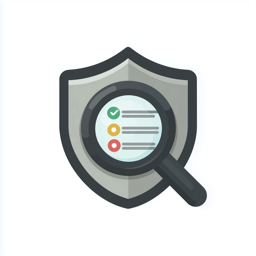
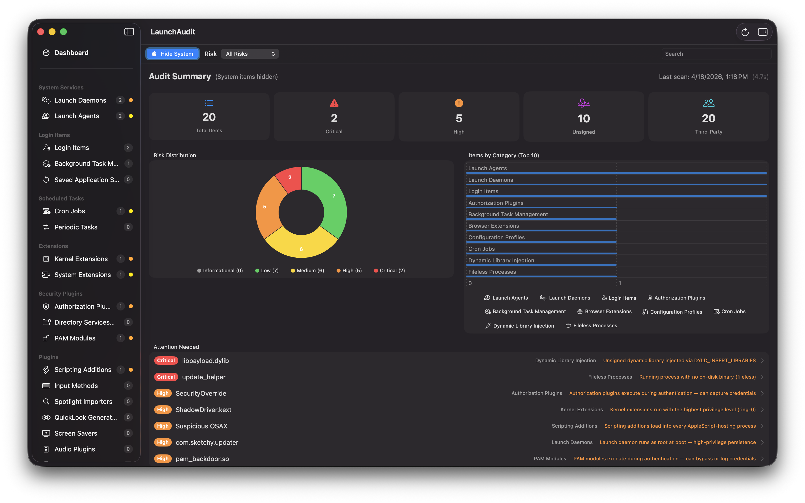
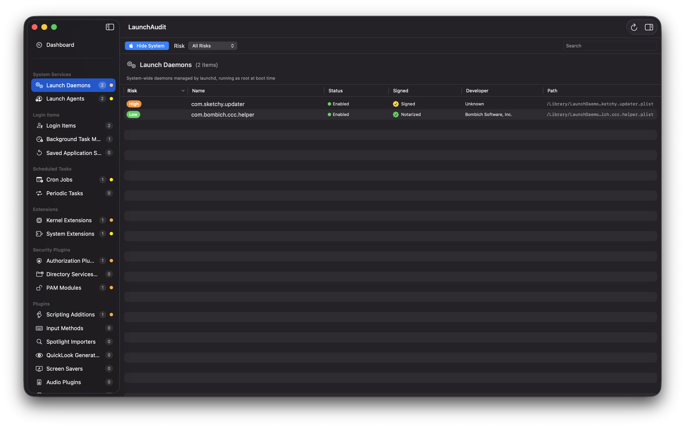
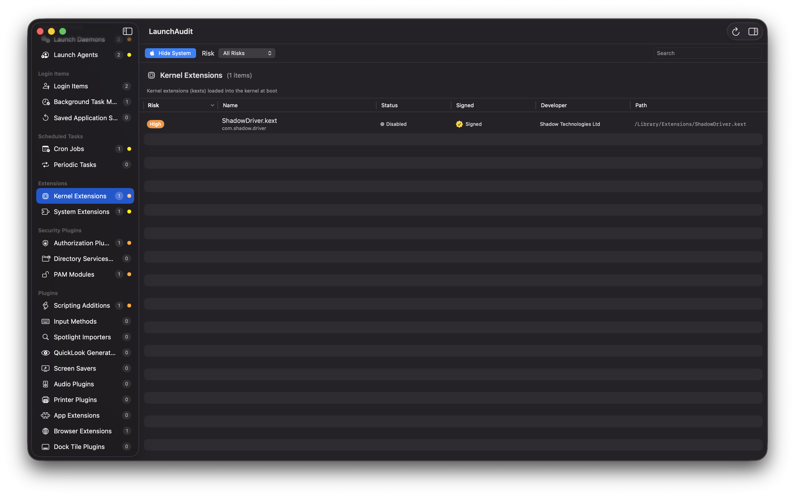
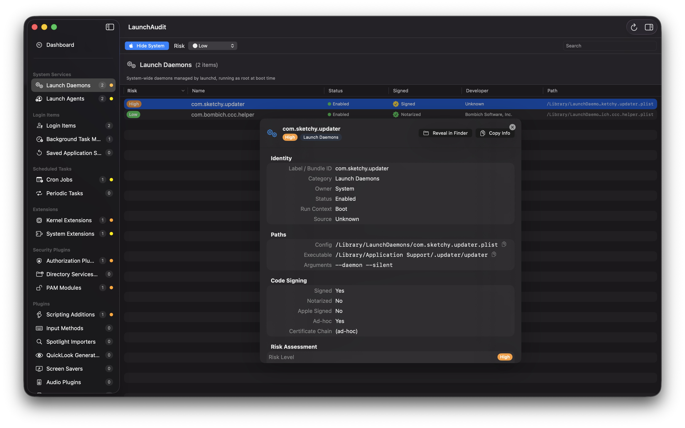
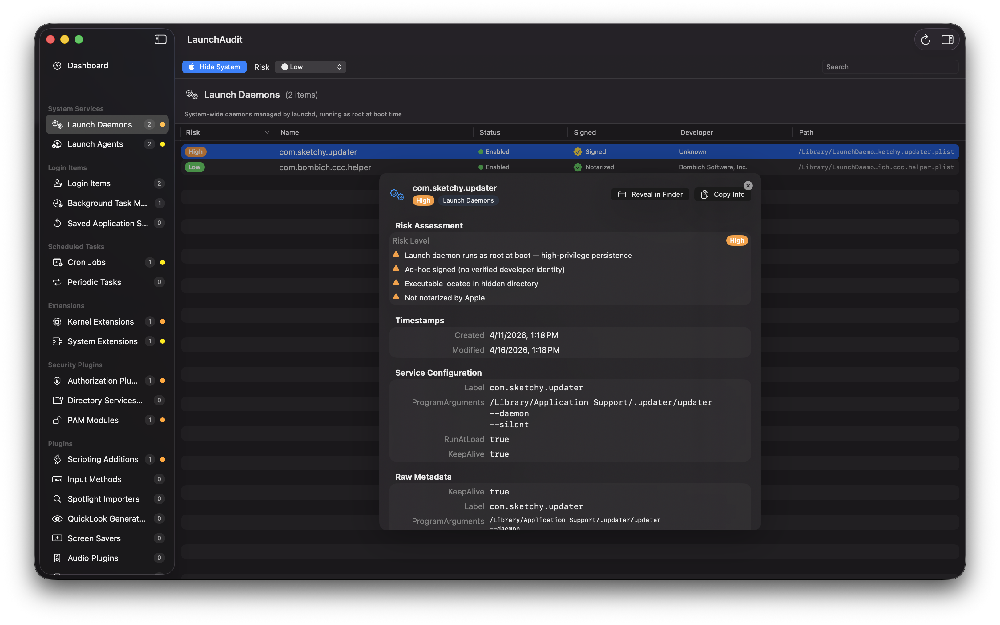
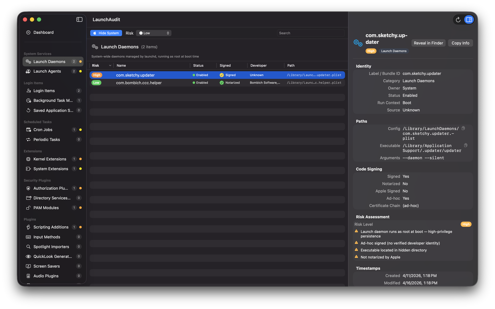

<p align="center">
  
</p>

<h1 align="center">LaunchAudit</h1>

<p align="center">
  <strong>Comprehensive macOS Persistence Auditor</strong><br>
  Discover every application, plugin, task, extension, or model registered to run on your Mac.
</p>

<p align="center">
  <a href="#features">Features</a> &bull;
  <a href="#screenshots">Screenshots</a> &bull;
  <a href="#installation">Installation</a> &bull;
  <a href="#building-from-source">Building</a> &bull;
  <a href="#usage">Usage</a> &bull;
  <a href="#architecture">Architecture</a> &bull;
  <a href="#contributing">Contributing</a> &bull;
  <a href="#license">License</a>
</p>

<p align="center">
  
  
  
  
</p>

---

## What Is LaunchAudit?

LaunchAudit scans your Mac for **every known persistence mechanism** — software configured to run automatically at boot, login, on a schedule, or in response to system events. It verifies code signatures, assesses risk, and presents everything in an interactive dashboard so you can understand exactly what's running (or capable of running) on your system.

Whether you're a security professional auditing endpoints, a sysadmin investigating suspicious behavior, or a power user who wants to know what's auto-launching — LaunchAudit gives you full visibility.

## Features

### 35 Persistence Categories

LaunchAudit scans every known macOS persistence mechanism:

| Group | Categories |
|-------|-----------|
| **System Services** | Launch Daemons, Launch Agents |
| **Login Items** | Login Items, Background Task Management (macOS 13+), Saved Application State |
| **Scheduled Tasks** | Cron Jobs, Periodic Tasks |
| **Extensions** | Kernel Extensions, System Extensions |
| **Security Plugins** | Authorization Plugins, Directory Services Plugins, PAM Modules |
| **Plugins** | Scripting Additions, Input Methods, Spotlight Importers, QuickLook Generators, Screen Savers, Audio Plugins, Printer Plugins, Dock Tile Plugins, App Extensions, Browser Extensions |
| **Environment** | Dynamic Library Injection, Shell Profiles, Fileless Processes |
| **Configuration** | Configuration Profiles, Privileged Helper Tools, XPC Services |
| **Event-Driven** | Event Monitor Rules, Folder Actions, Automator Workflows |
| **Deprecated/Legacy** | Login/Logout Hooks, Startup Items, RC Scripts, Widgets, Network Scripts |

### Code Signature Verification

- Validates signing status for every discovered executable
- Checks notarization status
- Extracts developer identity and team ID
- Distinguishes Apple-signed system components from third-party software
- Concurrent verification (up to 12 simultaneous checks)

### Risk Analysis

Each item is scored across multiple dimensions:

- **Signing Trust** — unsigned, ad-hoc, third-party signed, Apple signed
- **Mechanism Severity** — kernel extensions and PAM modules rank higher than screen savers
- **Execution Context** — boot-time and always-running items are flagged more aggressively
- **Location Anomalies** — unexpected paths or user-writable directories
- **Temporal Signals** — recently modified items in system directories
- **Content Signals** — suspicious arguments, environment variable injection

Risk levels: **Informational** | **Low** | **Medium** | **High** | **Critical**

### Interactive Dashboard

- Summary cards with total items, critical/high counts, unsigned items, and third-party counts
- Risk distribution donut chart with hover and click interaction
- Category bar chart (top 10)
- Attention needed section highlighting high/critical items
- Scan warnings for permission-denied or inaccessible locations

### Filtering & Search

- Hide Apple-signed items to focus on third-party software
- Filter by minimum risk level
- Full-text search across item names, labels, paths, and metadata

### Export Reports

- **JSON** — machine-readable, full fidelity
- **CSV** — spreadsheet-compatible flat export
- **HTML** — self-contained, styled report suitable for sharing

### Additional Features

- Sidebar navigation grouped by persistence category
- Detail inspector panel with full item metadata
- Reveal in Finder and copy path from context menus
- Keyboard shortcuts (`Cmd+R` scan, `Cmd+Shift+E` export, `Cmd+Shift+H` hide Apple items)
- Welcome screen with first-launch onboarding

## Screenshots

Dashboard:


Findings:



Inspector:



Details:


## Installation

### Requirements

- macOS 14.0 (Sonoma) or later
- Xcode 16.0 or later (for building from source)

### Download

Download the latest release from the [Releases](../../releases) page.

### Homebrew

LaunchAudit is available as a Homebrew cask from this repository's tap:

```bash
# Add the tap (one-time)
brew tap shmoopi/launchaudit https://github.com/shmoopi/LaunchAudit.git

# Install
brew install --cask launchaudit
```

To upgrade to a new version:

```bash
brew upgrade --cask launchaudit
```

## Building from Source

LaunchAudit uses [XcodeGen](https://github.com/yonaskolb/XcodeGen) to generate the Xcode project from `project.yml`.

```bash
# 1. Install XcodeGen if you don't have it
brew install xcodegen

# 2. Clone the repository
git clone https://github.com/user/LaunchAudit.git
cd LaunchAudit

# 3. Generate the Xcode project
xcodegen generate

# 4. Open in Xcode
open LaunchAudit.xcodeproj

# 5. Build and run (Cmd+R)
```

### Command-Line Build

```bash
xcodebuild -project LaunchAudit.xcodeproj \
  -scheme LaunchAudit \
  -configuration Release \
  -derivedDataPath build/ \
  build
```

### Running Tests

```bash
xcodebuild test \
  -project LaunchAudit.xcodeproj \
  -scheme LaunchAudit \
  -configuration Debug
```

## Usage

### First Launch

1. Open LaunchAudit — a welcome screen explains what the app does
2. Click **Begin Audit** to start your first scan
3. You may be prompted for your administrator password to access system directories

### Scanning

- The scan runs in three phases: **Persistence Discovery** → **Signature Verification** → **Risk Analysis**
- Progress is shown with a live overlay
- Typical scans complete in a few seconds

### Navigating Results

- The **Dashboard** provides a high-level overview with charts and summary cards
- Click any category in the **Sidebar** to view its items
- Select an item and open the **Inspector** (`Cmd+Option+I`) for full details
- Use the **filter bar** to hide Apple items, filter by risk, or search

### Exporting

Use `File > Export as JSON/CSV/HTML` or the keyboard shortcut `Cmd+Shift+E` to export scan results.

### Administrator Access

LaunchAudit never modifies any files — it only reads system state. Some system locations require elevated privileges:

- System Launch Daemons & Agents (`/Library/LaunchDaemons`, `/Library/LaunchAgents`)
- Privileged Helper Tools (`/Library/PrivilegedHelperTools`)
- Security & Auth Plugins
- Kernel & System Extensions
- Background Task Management database
- Configuration Profiles

If you decline the password prompt, the scan will still cover all items readable by your user account.

## Architecture

```
LaunchAudit/
├── LaunchAudit/                 # Main app target (SwiftUI)
│   ├── App/                     # App entry point, ContentView
│   ├── Views/                   # Dashboard, Sidebar, ItemList, Detail, Export, Welcome
│   ├── ViewModels/              # ScanViewModel
│   └── Assets.xcassets/         # App icon and asset catalog
│
├── LaunchAuditKit/              # Core framework (scanner logic)
│   ├── Models/                  # PersistenceItem, PersistenceCategory, RiskLevel, etc.
│   ├── Scanners/                # 35 individual PersistenceScanner implementations
│   ├── Analysis/                # RiskAnalyzer, RiskClassifier, SigningVerifier
│   ├── Coordination/            # ScanCoordinator, PrivilegeBroker, HelperProtocol
│   ├── Utilities/               # PlistParser, PathUtilities, ProcessRunner
│   └── Export/                  # JSON, CSV, HTML exporters
│
├── LaunchAuditHelper/           # Privileged helper tool (XPC)
│   ├── main.swift
│   ├── HelperDelegate.swift
│   └── Info.plist
│
├── LaunchAuditTests/            # Unit tests
│   ├── ScannerTests/
│   └── AnalysisTests/
│
├── Casks/
│   └── launchaudit.rb           # Homebrew cask formula
├── project.yml                  # XcodeGen project specification
└── README.md
```

### Key Design Decisions

- **Concurrent scanning** — all 35 scanners run in parallel using Swift `TaskGroup`
- **Sliding-window signature verification** — up to 12 concurrent `SecStaticCode` checks
- **Strict concurrency** — `SWIFT_STRICT_CONCURRENCY: complete` with all models `Sendable`
- **Read-only** — the app never modifies system files, only reads and reports
- **Modular scanners** — each persistence mechanism is its own scanner conforming to `PersistenceScanner`

## Contributing

Contributions are welcome! Please read the guidelines below before submitting.

### How to Contribute

1. **Fork** the repository
2. **Create a branch** for your feature or fix (`git checkout -b feature/my-feature`)
3. **Make your changes** and add tests where appropriate
4. **Run the test suite** to verify nothing is broken
5. **Submit a pull request** using the PR template

### Development Setup

```bash
# Install dependencies
brew install xcodegen swiftlint

# Generate project and open
xcodegen generate && open LaunchAudit.xcodeproj
```

### Adding a New Scanner

1. Create a new file in `LaunchAuditKit/Scanners/`
2. Implement the `PersistenceScanner` protocol
3. Add a case to `PersistenceCategory`
4. Register the scanner in `ScanCoordinator.scanners`
5. Add unit tests in `LaunchAuditTests/ScannerTests/`

### Code Style

- Swift 5.9 with strict concurrency
- SwiftUI for all UI
- No third-party dependencies
- All models must be `Sendable`

### Reporting Issues

- Use the [Bug Report](.github/ISSUE_TEMPLATE/bug_report.md) template for bugs
- Use the [Feature Request](.github/ISSUE_TEMPLATE/feature_request.md) template for ideas
- Use the [New Scanner](.github/ISSUE_TEMPLATE/new_scanner.md) template to suggest persistence mechanisms we don't cover yet

## License

LaunchAudit is released under the [MIT License](LICENSE).

```
Copyright (c) 2026 Shmoopi LLC
```
