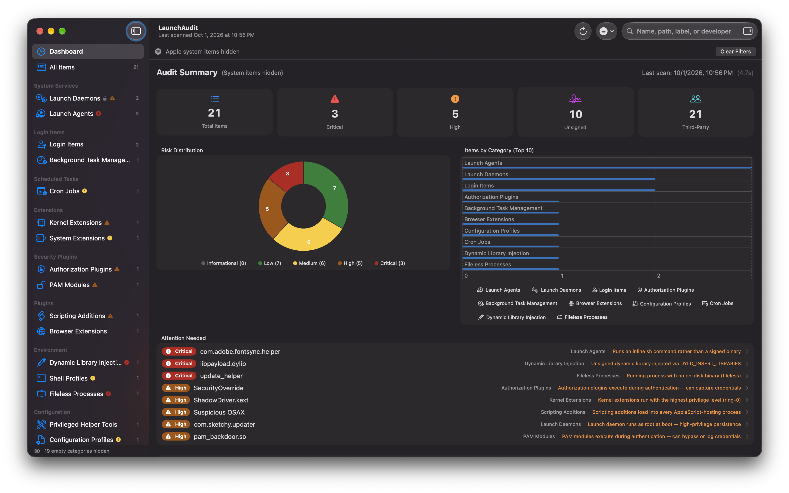
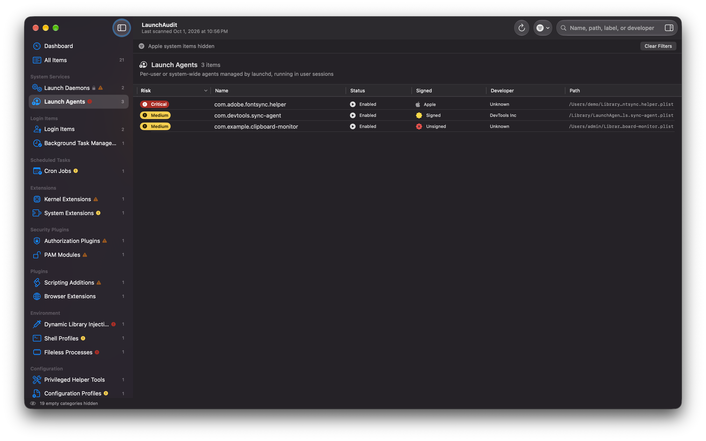
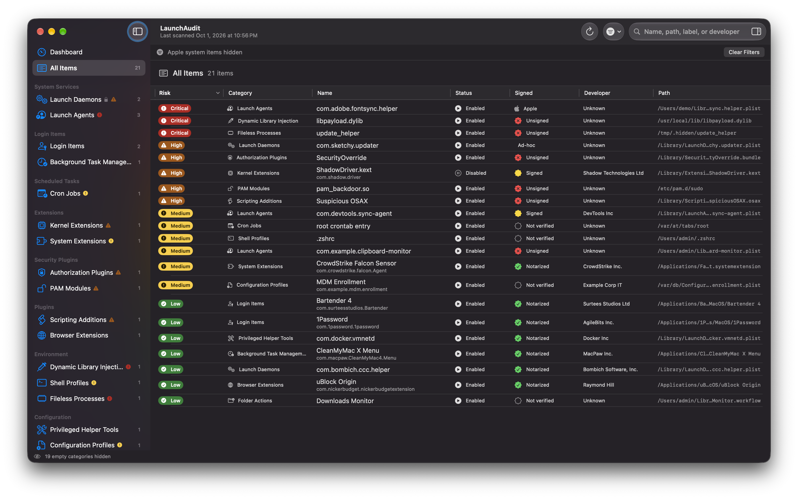
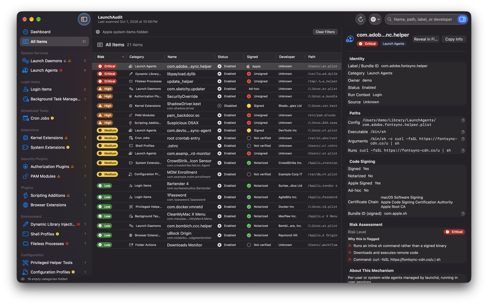
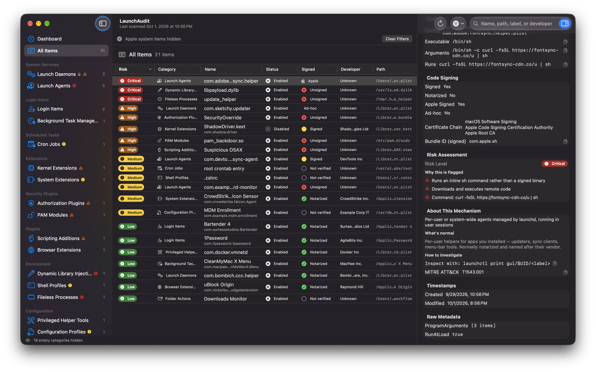
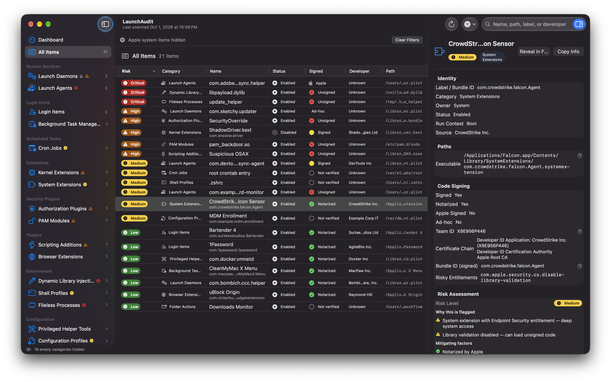

<p align="center">
  
</p>

<h1 align="center">LaunchAudit</h1>

<p align="center">
  <strong>Comprehensive macOS Persistence Auditor</strong><br>
  Discover every application, plugin, task, extension, or model registered to run on macOS.<br>
</p>

<p align="center">
  <a href="#features">Features</a> &bull;
  <a href="#screenshots">Screenshots</a> &bull;
  <a href="#installation">Installation</a> &bull;
  <a href="#building-from-source">Building</a> &bull;
  <a href="#usage">Usage</a> &bull;
  <a href="#command-line-interface">CLI</a> &bull;
  <a href="#troubleshooting">Troubleshooting</a> &bull;
  <a href="#architecture">Architecture</a> &bull;
  <a href="#contributing">Contributing</a> &bull;
  <a href="#license">License</a>
</p>

<p align="center">
  
  
  
  
</p>

---

## What Is LaunchAudit?

LaunchAudit scans your Mac for **every known persistence mechanism** - software configured to run automatically at boot, login, on a schedule, or in response to system events. 

It verifies code signatures, assesses risk, and presents everything in an interactive dashboard so you can understand exactly what's running (or capable of running) on your system.

Whether you're a security professional auditing endpoints, a sysadmin investigating suspicious behavior, or a power user who wants to know what's auto-launching, LaunchAudit gives you full visibility.

LaunchAudit ships as a single binary that works in two modes:

- **Application mode** — launch with no arguments to open the interactive dashboard
- **CLI mode** — pass any argument to run headless scans from the terminal, perfect for scripts, CI pipelines, and remote auditing over SSH

## Features

### Persistence Categories

LaunchAudit scans every known macOS persistence mechanism:

| Group | Categories |
|-------|-----------|
| **System Services** | Launch Daemons, Launch Agents |
| **Login Items** | Login Items, Background Task Management (macOS 13+), Saved Application State |
| **Scheduled Tasks** | Cron Jobs, Periodic Tasks |
| **Extensions** | Kernel Extensions, System Extensions |
| **Security Plugins** | Authorization Plugins, Directory Services Plugins, PAM Modules |
| **Plugins** | Scripting Additions, Input Methods, Spotlight Importers, QuickLook Generators, Screen Savers, Audio Plugins, Printer Plugins, Dock Tile Plugins, App Extensions, Browser Extensions |
| **Environment** | Dynamic Library Injection, Shell Profiles, Fileless Processes |
| **Configuration** | Configuration Profiles, Privileged Helper Tools, XPC Services |
| **Event-Driven** | Event Monitor Rules, Folder Actions, Automator Workflows |
| **Deprecated/Legacy** | Login/Logout Hooks, Startup Items, RC Scripts, Widgets, Network Scripts |

### Code Signature Verification

- Validates signing status for every discovered executable
- Checks notarization status
- Extracts developer identity and team ID
- Distinguishes Apple-signed system components from third-party software
- Concurrent verification (up to 12 simultaneous checks)

### Risk Analysis

Each item is scored across multiple dimensions:

- **Signing Trust** — unsigned, ad-hoc, third-party signed, Apple signed
- **Mechanism Severity** — kernel extensions and PAM modules rank higher than screen savers
- **Execution Context** — boot-time and always-running items are flagged more aggressively
- **Location Anomalies** — unexpected paths or user-writable directories
- **Temporal Signals** — recently modified items in system directories
- **Content Signals** — suspicious arguments, environment variable injection

Risk levels: **Informational** | **Low** | **Medium** | **High** | **Critical**

### Interactive Dashboard

- Summary cards with total items, critical/high counts, unsigned items, and third-party counts
- Risk distribution donut chart with hover and click interaction
- Category bar chart (top 10)
- Attention needed section highlighting high/critical items
- Scan warnings for permission-denied or inaccessible locations

### Filtering & Search

- Hide Apple-signed items to focus on third-party software
- Filter by risk level
- Full-text search across item names, labels, paths, and metadata

### Export Reports

- **JSON** — machine-readable, full output
- **CSV** — spreadsheet-compatible export
- **HTML** — self-contained, styled report for sharing

### Command-Line Interface

LaunchAudit includes a full CLI:

- Run scans directly from the terminal with colored, structured output
- Filter by category, group, risk level, signing status, or text search
- Export to JSON, CSV, or HTML from the command line
- Convert previously saved JSON reports to other formats
- Quiet mode for scripting (`key=value` output) and verbose mode for deep inspection
- Live progress display on stderr (safe for piping stdout)
- Respects `NO_COLOR` and pipe detection for clean automation

### Additional Features

- Sidebar navigation grouped by persistence category
- Detail inspector panel with full item metadata
- Reveal in Finder and copy path from context menus
- Keyboard shortcuts (`Cmd+R` scan, `Cmd+Shift+E` export, `Cmd+Shift+H` hide Apple items)
- Welcome screen with first-launch onboarding

## Screenshots

Dashboard:


Findings:



Inspector:



Details:


## Installation

### Requirements

- macOS 14.0 (Sonoma) or later
- Xcode 16.0 or later (for building from source)

### Download

Download the latest release from the [Releases](../../releases) page.

### Homebrew

LaunchAudit is available as a Homebrew cask from this repository's tap:

```bash
# Add the tap (one-time)
brew tap shmoopi/launchaudit https://github.com/shmoopi/LaunchAudit.git

# Install — this also puts `launchaudit` on your PATH
brew install --cask launchaudit
```

To upgrade to a new version:

```bash
brew upgrade --cask launchaudit
```


## Usage

### First Launch

1. Open LaunchAudit - a welcome screen explains what the app does and what it reads
2. Click **Begin Audit** to start your first scan, or **Not Now** to look around first
3. macOS shows a **"Background Items Added"** notification and asks you to approve the LaunchAudit helper in **System Settings → General → Login Items &  Extensions**. There is no password prompt.
4. Declining is fine. The scan still runs; the two categories that need root are reported as *incomplete*. You can grant access later or use `sudo launchaudit scan` instead.

### Scanning

- The scan runs in three phases: **Persistence Discovery** → **Signature Verification** → **Risk Analysis**
- Progress appears in the toolbar and can be cancelled at any point (⌘.), so previous results stay readable while a new scan runs
- Typical scans complete in a few seconds

### Navigating Results

- The **Dashboard** gives a high-level overview; the summary cards are clickable and navigate to the matching items
- **All Items** lists everything across all categories; the sidebar lists each category with its count and highest risk
- Selecting a row opens the **Inspector**, which explains what the mechanism is, what normal looks like for it, why this item was flagged, any mitigating factors, and a command you can copy to investigate further
- **⌘F** searches every category at once, by name, path, label or developer
- The **Filter** menu in the toolbar hides Apple system items, filters by minimum risk, and narrows to unsigned or third-party items. Whenever a filter is active a bar across the top says so, so the numbers on screen are always explainable.

### Exporting

Use `File > Export as JSON/CSV/HTML` or the keyboard shortcut `Cmd+Shift+E` to export scan results.

---

## Command-Line Interface

When invoked with any argument, LaunchAudit runs in headless CLI mode — no window, no GUI, just terminal output.

Installing with Homebrew puts `launchaudit` on your PATH already. If you installed the app by hand, link it yourself:

```bash
# Homebrew users can skip this — the cask installs the `launchaudit` command.
sudo ln -s /Applications/LaunchAudit.app/Contents/MacOS/LaunchAudit \
    /usr/local/bin/launchaudit
```

Running `launchaudit` with no arguments in a terminal prints usage. Pass any command or flag to run headless; open the app from Finder for the GUI.

### Commands

| Command | Description |
|---------|-------------|
| `scan` | Scan for persistence mechanisms (default) |
| `categories` | List all persistence categories |
| `groups` | List all category groups |
| `export <file>` | Convert a saved JSON scan result to another format |
| `version` | Show version information |
| `help [command]` | Show help (optionally for a specific command) |

### Quick Start

```bash
# Run a scan (Apple-signed items are hidden by default)
launchaudit scan

# Include Apple-signed items
launchaudit scan --show-apple

# Show only high and critical risk items
launchaudit scan --min-risk high

# Show only unsigned items with full details
launchaudit scan --unsigned-only --verbose

# Export directly to JSON
launchaudit scan --format json -o report.json

# Export to HTML report
launchaudit scan -o report.html

# Quiet mode for scripting
launchaudit scan --quiet
# Output: critical=0 high=2 medium=5 low=12 info=31 total=50
```

### Scan Options

#### Output Options

| Option | Description |
|--------|-------------|
| `--format <fmt>` | Output format: `table`, `json`, `csv`, `html` (default: `table`) |
| `-o, --output <path>` | Write output to a file (format auto-detected from extension) |
| `--no-color` | Disable colored output |
| `--no-progress` | Disable the live progress display |
| `--quiet, -q` | Machine-readable summary as `key=value` pairs |
| `--verbose` | Show full details for every item (signing, timestamps, risk reasons) |

#### Filter Options

| Option | Description |
|--------|-------------|
| `--show-apple` | Include Apple-signed items (hidden by default) |
| `--hide-apple` | Hide Apple-signed items (this is the default) |
| `--min-risk <level>` | Minimum risk level: `informational`, `low`, `medium`, `high`, `critical` |
| `--unsigned-only` | Show only unsigned items |
| `--third-party` | Show only third-party (non-Apple) items |
| `--search, -s <query>` | Filter items by text search across names, labels, and paths |
| `--category <id>` | Restrict scan to a specific category (repeatable) |
| `--group <name>` | Restrict scan to a category group (repeatable) |

### Filtering by Category and Group

```bash
# List all available categories and their IDs
launchaudit categories

# List categories within a specific group
launchaudit categories --group "System Services"

# List all category groups
launchaudit groups

# Scan only Launch Daemons and Launch Agents
launchaudit scan --category launchDaemons --category launchAgents

# Scan all categories in the "Security Plugins" group
launchaudit scan --group "Security Plugins"
```

### Export and Format Conversion

```bash
# Save a scan as JSON for later analysis
launchaudit scan --format json -o audit-2026-04-25.json

# Convert a saved JSON scan to an HTML report
launchaudit export audit-2026-04-25.json --format html -o report.html

# Convert to CSV for spreadsheet import
launchaudit export audit-2026-04-25.json -o results.csv

# Pipe JSON directly to jq
launchaudit scan --format json | jq '.items[] | select(.riskLevel == "high")'
```

The output format is auto-detected from the file extension when using `-o`, so `--format` is only needed when writing to stdout or overriding the extension.

### Scripting and Automation

```bash
# Quick health check in a script
result=$(launchaudit scan --quiet)
critical=$(echo "$result" | grep -o 'critical=[0-9]*' | cut -d= -f2)
if [ "$critical" -gt 0 ]; then
  echo "WARNING: $critical critical persistence items found"
  exit 1
fi

# Pipe-safe — progress goes to stderr, data goes to stdout
launchaudit scan --format csv > items.csv

# Disable color for log files
launchaudit scan --no-color > audit.log 2>&1
```

---


## Administrator Access

LaunchAudit never modifies any files. It only reads system state. Some system locations require elevated privileges:

- System Launch Daemons & Agents (`/Library/LaunchDaemons`, `/Library/LaunchAgents`)
- Privileged Helper Tools (`/Library/PrivilegedHelperTools`)
- Security & Auth Plugins
- Kernel & System Extensions
- Background Task Management database
- Configuration Profiles

There are two ways to grant it:

- **GUI:** approve the LaunchAudit helper in System Settings → General → Login Items & Extensions. The helper runs as root, answers only the two privileged questions above on behalf of LaunchAudit, and exits 30 seconds after its last use. It verifies that the process talking to it is LaunchAudit, signed by the same team.
- **CLI:** run `sudo launchaudit scan`. No background item is involved.

Either way the scan still runs without privileges - it simply covers less. Anything that could not be inspected is reported explicitly under **Scan Coverage** in the GUI, in the `Coverage` block of terminal output, and in the header of an exported HTML report. A category that could not be read is never presented as a category that found nothing.

---


### Is it safe to run?

LaunchAudit asks for local administrator access to run privileged audits.

- **Releases are signed with a Developer ID, notarized by Apple, and stapled**, Gatekeeper opens them without a warning and without a right-click workaround.
- **It never modifies system state.** The tool only reads. There is no code path that deletes, moves, disables or rewrites anything it scans - the only files it writes are the reports.
- **It makes no network requests.** No telemetry, no analytics, no update check.
- **The privileged helper is minimal and optional.** It answers exactly two questions (Background Task Management and configuration profiles), only for LaunchAudit itself, and exits 30 seconds after its last use. If you would rather not install a background item, `sudo launchaudit scan` launches with privileges and doesn't require a helper.

Verify a download before running it:

```bash
# Signature and team identity
codesign -dv --verbose=4 /Applications/LaunchAudit.app

# Notarization and Gatekeeper acceptance
spctl --assess --type execute -vv /Applications/LaunchAudit.app
stapler validate /Applications/LaunchAudit.app

# Checksum against the published .sha256 from the release
shasum -a 256 LaunchAudit-v*.zip
```

## Using LaunchAudit in CI

Run LaunchAudit on a build machine, a self-hosted runner, or any Mac you manage, and have the job **fail automatically** when something risky is configured to launch. This is the main way teams use the CLI:

```bash
sudo launchaudit scan --fail-on high --quiet
```

It scans the machine, prints a single summary line, and **exits non-zero if anything scored High or Critical**. Drop it into any CI job and the job turns red when a new persistence item shows up.

| Flag | What it does |
|------|--------------|
| `--fail-on <level>` | Sets the threshold that fails the job: `low`, `medium`, `high`, or `critical` |
| `--quiet` | Prints one machine-readable line instead of a full report |
| `sudo` | Lets the scan read root-only locations. Without it, some categories are skipped |

### What the exit codes mean

| Exit code | Meaning | What to do |
|-----------|---------|------------|
| `0` | Clean — nothing reached your threshold | Nothing. The job passes. |
| `1` | A usage or file error, e.g. a typo'd flag | Check the command; the error is on stderr |
| `2` | **Findings** at or above your threshold | Investigate the items — this is the signal you asked for |
| `3` | **The scan was blind** — it lacked privileges to check everything | Add `sudo`, or accept reduced coverage |

Two things worth noting:

- **Exit `2` wins over `3`.** If the scan found something *and* wasn't complete, you get `2`.
- **Exit codes `2` and `3` only happen when you pass `--fail-on`.** Without it, a successful scan is always `0`.

### Reading the summary line

`--quiet` prints exactly one line:

```
critical=0 high=2 medium=9 low=41 info=6 total=58 errors=1 skipped=1 root=1
```

| Field | Meaning |
|-------|---------|
| `critical`, `high`, `medium`, `low`, `info` | Item counts per risk level |
| `total` | Items reported after filters |
| `errors` | Paths that could not be read |
| `skipped` | Categories skipped for lack of privileges |
| `root` | `1` if the scan ran with root, `0` if not |

`skipped` and `root` are the coverage signal. A line reading `critical=0 high=0 … skipped=4 root=0` is **not** a clean machine — it is a scan that never looked at four categories.

### A complete example

On a self-hosted macOS runner:

```yaml
name: Persistence Audit

on:
  schedule:
    - cron: "0 7 * * 1"   # Monday mornings
  workflow_dispatch:

jobs:
  audit:
    runs-on: [self-hosted, macOS]
    steps:
      - name: Scan for persistence
        run: sudo launchaudit scan --fail-on high --quiet

      - name: Save a full report
        if: always()        # keep the report even when the gate fails
        run: sudo launchaudit scan --format html -o report.html

      - uses: actions/upload-artifact@v4
        if: always()
        with:
          name: launchaudit-report
          path: report.html
```

`sudo` in CI needs a passwordless sudoers entry for the runner user, or run the job as root.

### Machine-readable output

For dashboards, diffing, or shipping to a SIEM, use `--format json`:

```bash
# Every high-or-worse finding, as JSON objects
launchaudit scan --format json | jq '.items[] | select(.riskLevel == "high")'

# Just the names and paths
launchaudit scan --format json | jq -r '.items[] | "\(.riskLevel)\t\(.name)\t\(.configPath)"'
```

Report Generation:

| Field | Why it matters |
|-------|----------------|
| `schemaVersion`, `toolVersion` | What produced the report, and which format it follows |
| `ranAsRoot` | Whether the scan had full privileges |
| `scannedCategories` | Which categories were covered |
| `appliedFilters` | Any filters used |
| `stableID` (per item) | A content-based ID that stays the same across scans so two reports can be compared |

Save a report today and diff it next week to see what changed:

```bash
launchaudit scan --format json -o baseline.json
# ...later...
launchaudit scan --format json -o today.json
diff <(jq -S '[.items[].stableID] | sort' baseline.json) \
     <(jq -S '[.items[].stableID] | sort' today.json)
```

### Tips

- **Progress goes to stderr, data to stdout**, so `launchaudit scan --format csv > items.csv` is safe to pipe.
- **Color turns itself off** when output isn't a terminal. `NO_COLOR=1` forces it off; `FORCE_COLOR=1` forces it on for log viewers that render ANSI.
- **Scope the scan to go faster.** `--category launchdaemons --category launchagents` only runs those scanners rather than all checks.

---

## Troubleshooting

**`brew install --cask launchaudit` fails with a checksum mismatch.**
The cask is generated when a release is published. If you see a placeholder hash, no release has been published yet — download from the Releases page instead.

**The app says a category "could not be fully scanned".**
That category needs administrator privileges. Approve the helper in System Settings → General → Login Items & Extensions, or run `sudo launchaudit scan`. This message means the tool could not look.

**"Could not query System Events for login items."**
macOS denied the Automation prompt. Grant access in System Settings → Privacy & Security → Automation, or ignore it: Background Task Management covers the same ground on macOS 13+ and the CLI skips this check entirely.

**The helper never appears in System Settings.**
Helper registration requires the app to be signed and notarized. A locally built, unsigned copy cannot register one, and its helper will refuse connections by design. Use `sudo launchaudit scan` with local builds.

**Everything shows as "Not verified".**
That is a third state, distinct from unsigned: the signature could not be checked. It usually means the file is unreadable at your privilege level.

---

## Uninstalling

```bash
brew uninstall --zap --cask launchaudit
```

If you installed by hand, remove the app and the helper registration:

```bash
sudo launchctl bootout system/net.shmoopi.launchaudit.helper 2>/dev/null
rm -rf /Applications/LaunchAudit.app
rm -rf ~/Library/Caches/net.shmoopi.launchaudit \
       ~/Library/Preferences/net.shmoopi.launchaudit.plist
```

---

## Building from Source

LaunchAudit uses [XcodeGen](https://github.com/yonaskolb/XcodeGen) to generate the Xcode project from `project.yml`.

```bash
# 1. Install XcodeGen if you don't have it
brew install xcodegen

# 2. Clone the repository
git clone https://github.com/user/LaunchAudit.git
cd LaunchAudit

# 3. Generate the Xcode project
xcodegen generate

# 4. Open in Xcode
open LaunchAudit.xcodeproj

# 5. Build and run (Cmd+R)
```

### Command-Line Build

```bash
xcodebuild -project LaunchAudit.xcodeproj \
  -scheme LaunchAudit \
  -configuration Release \
  -derivedDataPath build/ \
  build
```

### Running Tests

```bash
xcodebuild test \
  -project LaunchAudit.xcodeproj \
  -scheme LaunchAudit \
  -configuration Debug
```

---

## Architecture

```
LaunchAudit/
├── LaunchAudit/                 # Main app target
│   ├── App/
│   │   ├── Entry.swift          # @main — routes to GUI or CLI based on arguments
│   │   ├── LaunchAuditApp.swift # SwiftUI App (GUI mode)
│   │   └── ContentView.swift
│   ├── CLI/
│   │   ├── CLI.swift            # Argument parser, command dispatch, scan runner
│   │   └── Terminal.swift       # ANSI formatting, structured output, help text
│   ├── Views/                   # Dashboard, Sidebar, ItemList, Detail, Export, Welcome
│   ├── ViewModels/              # ScanViewModel
│   └── Assets.xcassets/         # App icon and asset catalog
│
├── LaunchAuditKit/              # Core framework (scanner logic, shared by GUI + CLI)
│   ├── Models/                  # PersistenceItem, PersistenceCategory, RiskLevel, etc.
│   ├── Scanners/                # Individual PersistenceScanner implementations
│   ├── Analysis/                # Risk scoring, signature verification, launchd state
│   ├── Coordination/            # ScanCoordinator, PrivilegeBroker, HelperProtocol
│   ├── Utilities/               # PlistParser, PathUtilities, ProcessRunner, SafeRead
│   └── Export/                  # JSON, CSV, HTML exporters
│
├── LaunchAuditHelper/           # Privileged helper tool (XPC)
│   ├── main.swift
│   ├── HelperDelegate.swift
│   └── Info.plist
│
├── LaunchAuditTests/            # Unit tests
│   ├── ScannerTests/
│   └── AnalysisTests/
│
├── Casks/
│   └── launchaudit.rb           # Homebrew cask formula
├── project.yml                  # XcodeGen project specification
└── README.md
```

## Contributing

Contributions are welcome! Please read the guidelines below before submitting.

### How to Contribute

1. **Fork** the repository
2. **Create a branch** for your feature or fix (`git checkout -b feature/my-feature`)
3. **Make your changes** and add tests where appropriate
4. **Run the test suite** to verify nothing is broken
5. **Submit a pull request** using the PR template

### Development Setup

```bash
# Install dependencies
brew install xcodegen swiftlint

# Generate project and open
xcodegen generate && open LaunchAudit.xcodeproj
```

### Adding a New Scanner

1. Create a new file in `LaunchAuditKit/Scanners/`
2. Implement the `PersistenceScanner` protocol
3. Add a case to `PersistenceCategory`
4. Register the scanner in `ScanCoordinator.scanners`
5. Add unit tests in `LaunchAuditTests/ScannerTests/`

### Code Style

- Swift 5.9 with strict concurrency
- No third-party dependencies
- All models must be `Sendable`

### Reporting Issues

- Use the [Bug Report](.github/ISSUE_TEMPLATE/bug_report.md) template for bugs
- Use the [Feature Request](.github/ISSUE_TEMPLATE/feature_request.md) template for ideas
- Use the [New Scanner](.github/ISSUE_TEMPLATE/new_scanner.md) template to suggest persistence mechanisms we don't cover yet

## License

LaunchAudit is released under the [MIT License](LICENSE).

```
Copyright (c) 2026 Shmoopi LLC
```
